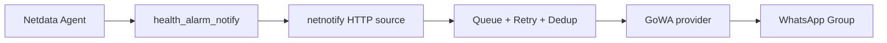

# netnotify

Universal Notification Gateway for Infrastructure Monitoring.

[](https://github.com/bitlab-dev/netnotify/actions)
[](LICENSE)

netnotify receives alerts from monitoring agents and routes them to notification providers. The first production path is Netdata Agent `health_alarm_notify` to GoWA and WhatsApp groups without Netdata Cloud Pro.



## Features

- Clean Architecture with source and provider interfaces.
- Netdata Agent source endpoint.
- GoWA provider using `POST /send/message`, Basic Auth, `X-Device-Id`, HTTPS, group and individual recipients, mentions, retry, timeout and TLS verification controls.
- YAML, environment variables and CLI flags with CLI > ENV > YAML precedence.
- Worker queue, retry queue, dead-letter storage, duplicate detection and rate limiting.
- External Go templates for critical, warning, clear and test messages.
- JSON or console logging with file rotation.
- Prometheus `/metrics` and `/health` endpoints.
- Docker, Compose, systemd, GitHub Actions and GoReleaser assets.

## Quick start

```bash
cp configs/config.example.yaml config.yaml
export NETNOTIFY_PROVIDERS_GOWA_USERNAME=admin
export NETNOTIFY_PROVIDERS_GOWA_PASSWORD=secret
go run ./cmd/netnotify --config config.yaml
```

Send a Netdata-compatible alert:

```bash
curl -X POST http://127.0.0.1:8080/v1/sources/netdata \
  -d alarm=cpu_usage -d status=CRITICAL -d hostname=node-01
```

## CLI

`netnotify` includes `install`, `uninstall`, `validate`, `doctor`, `send`, `test`, `version`, `config`, `providers`, `sources`, `logs` and `health` commands. Packaged installation commands install the systemd service and Netdata helper script.

## Roadmap

- Telegram, Slack, Discord, Teams, Google Chat, Mattermost, Rocket.Chat, ntfy, Gotify, Pushover, Signal, SMTP, Webhook, Apprise, Twilio, SMS and Matrix providers.
- Prometheus Alertmanager, Grafana, Uptime Kuma, Beszel, Zabbix, Nagios, CheckMK, Icinga and custom webhook sources.
- Persistent queue backends and HA deployments.

## Documentation

See `docs/` for architecture, installation, configuration, development, contributing, security, troubleshooting, provider and source development, and releases.

## License

MIT.
