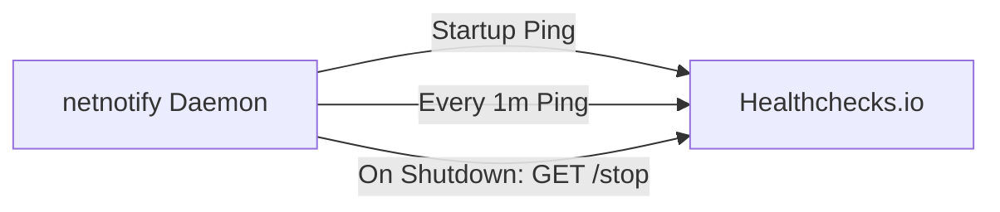

# netnotify

Lightweight, Dedicated Healthchecks.io Heartbeat Daemon for Servers & VMs.

[](https://github.com/BitLab-LK/netnotify/actions)
[](LICENSE)

`netnotify` is a dedicated single-purpose heartbeat daemon for servers and VMs. It periodically pings Healthchecks.io (or any compatible uptime heartbeat service) to act as a **Dead Man's Switch**, alerting you immediately if your VM goes offline or crashes.



---

## Features

- **Automated Heartbeats:** Sends startup pings and periodic pings (default `1m`) to Healthchecks.io.
- **Graceful Shutdown Signal:** Sends a `/stop` signal on `systemctl stop` to prevent false alerts during maintenance.
- **Local Health & Metrics Endpoint:** Exposes `http://127.0.0.1:8085/health` and `/metrics` for local health checks and Prometheus scraping.
- **Hardened systemd Service:** Includes systemd service configuration with locked-down security (`0600` secret security, non-root user, private temporary files).
- **1-Click Ubuntu Installer:** Interactive and headless non-interactive setup for Ubuntu / Debian.

---

## Setting Up Healthchecks.io

Before installing `netnotify`, you need a Healthchecks.io Ping URL.

### 1. Create a Healthchecks.io Account
1. Go to [Healthchecks.io](https://healthchecks.io) (or your self-hosted Healthchecks instance).
2. Click **Sign Up** (or Log In). Healthchecks.io offers a generous free tier supporting up to 20 checks.

### 2. Create and Configure a Check
1. On your Dashboard, click **Add Check**.
2. **Name & Tags:** Set a descriptive name (e.g. `prod-server-01` or `ubuntu-vm-main`).
3. **Period & Grace Time:**
   - **Period:** Set the expected interval between pings (e.g., `1 minute` to match `netnotify`'s default `1m` interval).
   - **Grace Time:** Set how long Healthchecks.io waits after a missed ping before marking the check as **DOWN** (e.g. `2 minutes` to prevent false alarms from temporary network glitches).
4. **Alert Channels (Integrations):**
   - Click **Integrations** in the top navigation to link your preferred notification channels (Email, Telegram, Slack, Discord, PagerDuty, Webhooks, etc.).
5. **Copy the Ping URL:**
   - Copy the unique **Ping URL** generated for your check (e.g. `https://hc-ping.com/your-uuid-here`).

---

## One-Line Ubuntu Installation

### Interactive Installation
Run the installer on your Ubuntu / Debian VM:

```bash
curl -fsSL https://raw.githubusercontent.com/BitLab-LK/netnotify/main/scripts/install-ubuntu.sh | sudo bash
```

The installer will prompt for:
- **Healthchecks.io Ping URL**: Paste your check's Ping URL (`https://hc-ping.com/your-uuid-here`).
- **Ping Interval**: Desired ping frequency (default `1m`).
- **Local Listen Address**: Local endpoint address (default `127.0.0.1:8085`).

### Headless / Automated Installation
To install non-interactively (e.g., via cloud-init, CI/CD, or Ansible scripts):

```bash
sudo env \
  NETNOTIFY_HEARTBEAT_URL="https://hc-ping.com/your-uuid-here" \
  NETNOTIFY_HEARTBEAT_INTERVAL="1m" \
  NETNOTIFY_LISTEN_ADDRESS="127.0.0.1:8085" \
  bash -c "$(curl -fsSL https://raw.githubusercontent.com/BitLab-LK/netnotify/main/scripts/install-ubuntu.sh)"
```

---

## Quick Start (Local / Manual)

Run locally using Go:

```bash
cp configs/config.example.yaml config.yaml
export NETNOTIFY_HEARTBEAT_URL="https://hc-ping.com/your-uuid-here"
go run ./cmd/netnotify --config config.yaml
```

Test a manual heartbeat ping:

```bash
go run ./cmd/netnotify ping --config config.yaml
```

Check local health endpoint:

```bash
curl -fsS http://127.0.0.1:8085/health
```

---

## Configuration Reference

Configuration is loaded from `/etc/netnotify/config.yaml` and can be overridden via environment variables:

| Environment Variable | YAML Key | Default | Description |
| :--- | :--- | :--- | :--- |
| `NETNOTIFY_HEARTBEAT_URL` | `heartbeat.url` | `""` | Healthchecks.io Ping URL |
| `NETNOTIFY_HEARTBEAT_INTERVAL` | `heartbeat.interval` | `1m` | Ping frequency (e.g. `1m`, `5m`) |
| `NETNOTIFY_HEARTBEAT_SEND_STOP_ON_EXIT` | `heartbeat.send_stop_on_exit` | `true` | Send `/stop` ping on service shutdown |
| `NETNOTIFY_SERVER_ADDRESS` | `server.address` | `127.0.0.1:8085` | Local listen address for `/health` and `/metrics` |

---

## Verification & Management

```bash
# Check systemd service status
systemctl status netnotify

# View live service logs
journalctl -u netnotify -f

# Verify local health endpoint
curl -fsS http://127.0.0.1:8085/health

# Trigger a manual CLI ping check
netnotify ping --config /etc/netnotify/config.yaml
```

---

## License

[MIT](LICENSE)
